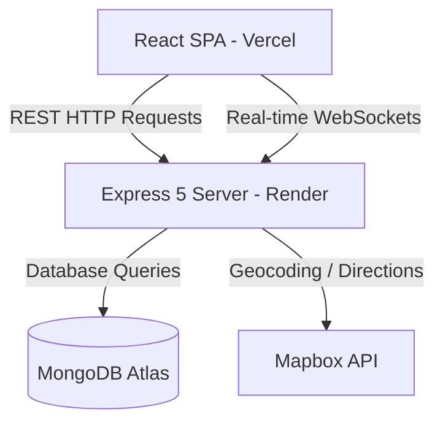

# Sarthi 🚖

Sarthi is a real-time ride-sharing platform that connects riders and captains instantly. Built on a modern tech stack, the platform facilitates geolocated matching, real-time coordination, dynamic pricing, and secure OTP verification to streamline user rides.

Live Demo: [https://sarthi-pied.vercel.app](https://sarthi-pied.vercel.app)

---

## Features

- **Dual-Role Authentication**: Secure login and sign-up flows for both **Riders** and **Captains** backed by JWT (JSON Web Tokens) and bcrypt password hashing.
- **Geospatial Captain Discovery**: Uses MongoDB 2dsphere indexing and geospatial query operators (`$near` with `$maxDistance`) to find available captains within a configurable radius of the rider's pickup point.
- **Real-Time Ride Matching**: Two-way real-time communication via JWT-authenticated Socket.io channels for handling ride requests, acceptances, and status updates.
- **Live Tracking & Route Navigation**: Interactive Leaflet maps rendering route polylines and live captain location markers on the frontend.
- **Secure 6-Digit OTP Verification**: A robust OTP system where the ride start requires a cryptographically random 6-digit verification code featuring:
  - 10-minute expiration window.
  - 5-attempt incorrect entry lockout security.
- **Dynamic Fare Engine**: Pre-calculated rates based on distance (meters) and duration (seconds) with tailored rates for Auto, Car, and Bike vehicles.
- **Mapbox Geocoding & Routing Fallbacks**: Integration with Mapbox Places and Mapbox Directions API, with clean local fallbacks (Surat coordinates / Haversine formula) on external failure.
- **Production-Grade Middleware**: Secured with Helmet security headers, trust proxy configurations, global rate limiters, and endpoint-specific strict rate limiting.

---

## Tech Stack

### Frontend
- **React 19** (`^19.2.0`) & **React DOM** (`^19.2.0`)
- **Vite** (`^7.2.4`)
- **Tailwind CSS 4** (`^4.1.18` via `@tailwindcss/vite`)
- **React Leaflet** (`^5.0.0`) & **Leaflet** (`^1.9.4`)
- **Mapbox GL** (`^3.24.0`)
- **GSAP** (`^3.14.2` & `@gsap/react` `^2.1.2`)
- **Socket.io Client** (`^4.8.3`)
- **Axios** (`^1.13.2`)

### Backend
- **Node.js**
- **Express 5** (`^5.2.1`)
- **MongoDB** & **Mongoose** (`^9.0.1`)
- **Socket.io** (`^4.8.3`)
- **Helmet** (`^8.2.0`) & **Express Rate Limit** (`^8.5.2`)
- **JSON Web Tokens (JWT)** (`^9.0.3`) & **Bcrypt** (`^6.0.0`)
- **Cookie Parser** (`^1.4.7`)

---

## Architecture Overview



### Ride Lifecycle State Machine
A ride follows a strict state transition flow to maintain integrity:
1. **Pending**: Rider requests a ride. Nearby captains are notified via Socket.io.
2. **Accepted**: Captain accepts the ride. A 6-digit OTP and captain details are generated and sent to the rider.
3. **Ongoing**: Captain arrives and verifies the rider's OTP. Upon successful verification, the ride starts.
4. **Completed**: Captain reaches the destination, completes the trip, and updates status to available.

---

## Screenshots

| Rider Home | Vehicle Selection | Captain Dashboard | Live Tracking |
| :---: | :---: | :---: | :---: |
|  |  |  |  |

*Note: Screenshots to be added.*

---

## Local Setup

### Prerequisites
- Node.js (version 18+)
- MongoDB (Local instance or MongoDB Atlas cluster connection string)
- Mapbox Access Token (for geocoding and live mapping functionalities)

### 1. Clone Repository
```bash
git clone https://github.com/devarshijani/sarthi.git
cd sarthi
```

### 2. Backend Setup
1. Navigate to the backend directory:
   ```bash
   cd backend
   ```
2. Install dependencies:
   ```bash
   npm install
   ```
3. Create `.env` from `.env.example`:
   ```bash
   cp .env.example .env
   ```
4. Configure variables inside `.env`:
   - `PORT`: Port the server runs on (default `4000`).
   - `DB_CONNECT`: MongoDB connection string.
   - `JWT_SECRET`: Secret key used for signing JWT authentications.
   - `ALLOWED_ORIGINS`: Permitted CORS origins (comma-separated).
   - `MAPBOX_TOKEN`: Mapbox API token for geocoding and directions.
5. Start the server:
   ```bash
   npm start
   ```

### 3. Frontend Setup
1. Navigate to the frontend directory:
   ```bash
   cd ../frontend
   ```
2. Install dependencies:
   ```bash
   npm install
   ```
3. Create `.env` from `.env.example`:
   ```bash
   cp .env.example .env
   ```
4. Configure variables inside `.env`:
   - `VITE_API_URL`: REST API server endpoint URL (e.g. `http://localhost:4000`).
   - `VITE_BACKEND_URL`: Server WebSocket connection endpoint (e.g. `http://localhost:4000`).
   - `VITE_BASE_URL`: Base URL for REST endpoints (e.g. `http://localhost:4000`).
   - `VITE_MAPBOX_TOKEN`: Client-side Mapbox access token.
5. Start the development server:
   ```bash
   npm run dev
   ```

---

## API Reference

### REST Endpoints

| Method | Path | Auth Required | Purpose |
| :--- | :--- | :---: | :--- |
| **POST** | `/api/users/register` | No | Registers a new rider account. |
| **POST** | `/api/users/login` | No | Authenticates a rider and issues a JWT token. |
| **GET** | `/api/users/profile` | Yes (Rider JWT) | Retrieves the authenticated rider's profile. |
| **GET** | `/api/users/logout` | Yes (Rider JWT) | Invalidates the active token and logs out the rider. |
| **POST** | `/api/captains/signup` | No | Registers a new captain account. |
| **POST** | `/api/captains/login` | No | Authenticates a captain and issues a JWT token. |
| **GET** | `/api/captains/profile` | Yes (Captain JWT) | Retrieves the authenticated captain's profile. |
| **GET** | `/api/captains/logout` | Yes (Captain JWT) | Invalidates the active token and logs out the captain. |
| **GET** | `/api/maps/get-coordinates` | No | Translates an address text query into coordinate values. |
| **GET** | `/api/maps/get-distance-time` | No | Returns distance and duration metrics between origin and destination coordinates. |
| **GET** | `/api/maps/get-suggestions` | No | Fetches geocoding autocomplete place suggestions. |
| **GET** | `/api/maps/reverse-geocode` | No | Resolves address labels from latitude/longitude values. |
| **POST** | `/rides/create` | Yes (Rider JWT) | Places a new ride request order. |
| **GET** | `/rides/fare` | No | Returns ride cost breakdowns across all vehicle classes. |

---

### Socket.io Events

| Event Name | Direction | Payload / Parameters | Purpose |
| :--- | :---: | :--- | :--- |
| `connection` | Client $\rightarrow$ Server | - | Establishes the real-time websocket connection. |
| `join` | Client $\rightarrow$ Server | - | Registers the socket to the authenticated user ID and saves connection metadata. |
| `update-location-captain` | Client $\rightarrow$ Server | `{ location: { lat, lng } }` | Updates the active captain's geospatial coordinate in MongoDB. |
| `accept-ride` | Client $\rightarrow$ Server | `{ rideId }` | Triggers captain ride acceptance, generating OTP and notifying the rider. |
| `ride-start` | Client $\rightarrow$ Server | `{ rideId, otp }` | Initiates ride verification, matching OTP, and updating ride state to ongoing. |
| `complete-ride` | Client $\rightarrow$ Server | `{ rideId }` | Finalizes the trip and updates statuses back to available. |
| `new-ride` | Server $\rightarrow$ Client | `ride` details | Emits new trip request options to qualified nearby captains. |
| `ride-accepted` | Server $\rightarrow$ Client | `ride` & `captain` details | Emits confirmation details (including OTP) back to the rider. |
| `ride-started` | Server $\rightarrow$ Client | `ride` details | Emits state transition updates back to the rider when trip starts. |
| `ride-started-success` | Server $\rightarrow$ Client | `ride` details | Emits successful verification confirmation back to the captain. |
| `ride-completed` | Server $\rightarrow$ Client | `ride` details | Emits trip completion metrics to the rider for invoice display. |
| `ride-completed-success` | Server $\rightarrow$ Client | `ride` details | Emits trip completion confirmation back to the captain. |
| `unauthorized` | Server $\rightarrow$ Client | - | Emitted to captain if role or ownership checks fail. |
| `otp-invalid` | Server $\rightarrow$ Client | - | Emitted to captain if input OTP value does not match. |
| `otp-expired` | Server $\rightarrow$ Client | - | Emitted to captain if OTP start attempts happen after 10-minute expiry. |
| `otp-locked` | Server $\rightarrow$ Client | - | Emitted to captain if incorrect OTP attempts reach the lockout threshold (>= 5). |

---

## Project Structure

```
├── backend/
│   ├── config/          # Startup checks and validations
│   ├── controllers/     # Controllers matching API endpoints
│   ├── db/              # Database connections
│   ├── middlewares/     # Auth checks and route protections
│   ├── models/          # Mongoose model schemas
│   ├── routes/          # API route files
│   ├── services/        # Logic services (Mapbox API integration, ride handling)
│   ├── server.js        # Entrypoint (Boots server and handles sockets)
│   ├── socket.js        # Socket.io connection logic and event listeners
│   └── app.js           # Express app setup and middleware routing
└── frontend/
    └── src/
        ├── components/  # User UI components (location search, tracking, ride confirmation panels)
        ├── context/     # Socket and authentication contexts
        ├── pages/       # Router views (Dashboard, Riding screens, Login/Signup screens)
        ├── socket.js    # Singleton socket instance and client connection
        ├── App.jsx      # Main layout component and routing setup
        └── main.jsx     # Frontend entrypoint
```

---

## Author

**Devarshi Jani**
- **GitHub**: [github.com/devarshijani](https://github.com/devarshijani)
- **LinkedIn**: [linkedin.com/in/devarshi-jani-7074b52a0](https://www.linkedin.com/in/devarshi-jani-7074b52a0/)
